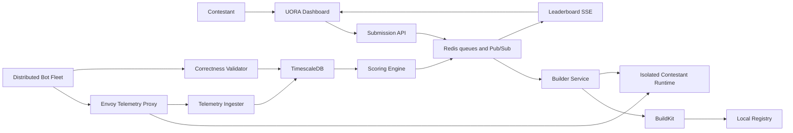
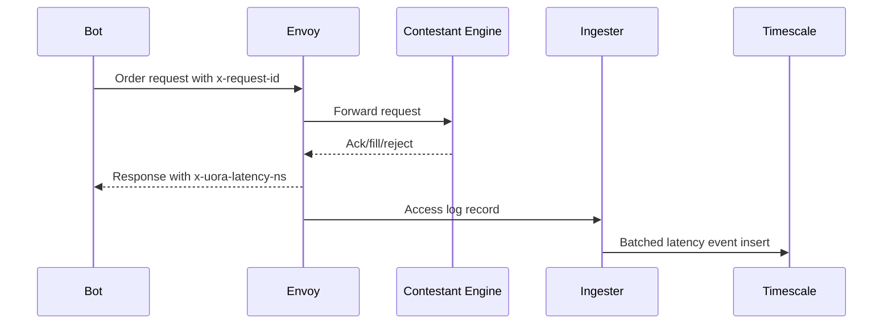

# UORA Architecture Blueprint

UORA is a distributed benchmarking and hosting platform for contestant-submitted
trading engines. The production goal is simple: accept untrusted matching-engine
code, build and run it in an isolated environment, generate realistic order flow,
capture latency and correctness telemetry, and stream a live composite ranking.

This document reflects the verified implementation in this repository. It avoids
demo-only claims and separates current behavior from the production scaling path.

## Requirement Coverage

| Requirement | UORA implementation |
| --- | --- |
| Code upload | FastAPI submission service accepts source uploads and enqueues build jobs. |
| Containerized deployment | Builder service uses BuildKit, local registry, Kubernetes pod/service specs, and Docker Compose for local orchestration. |
| Strict isolation | Kubernetes manifests use gVisor `runtimeClassName`, non-root containers, read-only root filesystems, dropped capabilities, and resource limits. |
| CPU and memory limits | Docker Compose and Kubernetes manifests define CPU and memory constraints for platform and contestant workloads. |
| Distributed bot fleet | Async bot coordinator runs deterministic REST order-flow scenarios; FIX support is a lightweight adapter path and is not the default production benchmark protocol. |
| Order types | Limit, market, and cancel actions are represented in bot scenarios and validator flows. |
| Telemetry | Envoy captures request latency headers and access logs; ingester persists records to TimescaleDB. |
| Latency metrics | Timescale hypertables and continuous aggregate expose p50, p90, and p99 latency windows. |
| Throughput | Bot coordinator records request counts and TPS; scoring uses throughput in the composite score. |
| Correctness | Deterministic reference limit order book validates price-time priority, fills, cancels, and response counts. |
| Live leaderboard | Redis Pub/Sub plus Next.js SSE stream live metrics and leaderboard entries to the dashboard. |
| Infrastructure as Code | Docker Compose, Kubernetes manifests, and Terraform skeleton are included for repeatable deployment. |

## System View



## Service Responsibilities

### Submission API

The submission service owns authentication, upload validation, build queueing,
and leaderboard streaming. It uses Redis for sessions, build job state, and live
events, and it initializes the Timescale schema during startup so a fresh local
stack can boot without manual SQL ordering.

Security defaults:

- Email and password auth is supported in addition to Google OAuth placeholders.
- Passwords are hashed with bcrypt.
- JWT sessions include `iat` and `exp`.
- Production mode requires `SESSION_SECRET`.
- Uploads are limited to supported engine languages: C++, Rust, and Go.

### Builder and Sandbox

The builder consumes Redis build jobs, creates OCI images with BuildKit, pushes
them to the local registry, and prepares the contestant runtime target. Local
development uses Docker Compose. Production deployment targets Kubernetes with:

- `runtimeClassName: gvisor`
- non-root security contexts
- dropped Linux capabilities
- read-only root filesystem
- CPU and memory requests/limits
- per-submission service discovery

### Bot Fleet

The bot fleet generates concurrent market traffic using deterministic scenarios.
The production benchmark path uses REST order requests. A lightweight FIX adapter
exists for compatibility experiments, but it is not the default scoring path.

The bot layer records:

- total requests
- success and error counts
- p50, p90, and p99 latency
- throughput over the benchmark interval
- circuit-breaker state when a target becomes unhealthy

### Telemetry Pipeline

Envoy sits between the bot fleet and contestant runtime. It stamps response
latency, writes structured access logs to a shared volume, and the ingester tails
that stream into TimescaleDB.



### Correctness Validator

The validator feeds the same action stream into a deterministic reference limit
order book and compares contestant responses against expected state transitions.
It explicitly checks for response-count mismatches so dropped acknowledgements
cannot be scored as clean runs.

Validation levels:

- L1: response shape and core order fields
- L2: fill and cancel semantics
- L3: price-time priority and book state
- L4: deterministic replay consistency

### Scoring

The scoring engine reads Timescale aggregates and correctness violations, then
calculates a composite score from:

- throughput
- p99 latency
- p50 latency
- p99-to-p50 tail ratio
- correctness rate
- error rate
- anomaly score

The anomaly detector returns a normalized 0-1 risk score. Higher values indicate
more suspicious behavior and reduce the final ranking.

## Data Stores

| Store | Purpose |
| --- | --- |
| Redis | sessions, build queue, build status, leaderboard Pub/Sub |
| TimescaleDB | latency events, correctness violations, benchmark scores, build events |
| MinIO | artifact storage path for local and future cloud-compatible uploads |
| Local registry | locally built contestant images for Docker/Kubernetes runtime |

## Local Deployment

The local stack is designed to run with:

```bash
cp .env.example .env
docker compose up -d
cd uora/leaderboard && npm run build && npm run start
```

Primary local endpoints:

- Dashboard: `http://localhost:3000/dashboard`
- Submission API: `http://localhost:8000`
- Envoy proxy: `http://localhost:10000`
- Redis: `localhost:6379` with password from `REDIS_URL`
- TimescaleDB: `localhost:5432`

## Production Scaling Path

UORA is structured so local services map cleanly to a cloud deployment:

1. Replace the local registry with ECR, Artifact Registry, or GHCR.
2. Run the submission API, builder, ingester, and scoring worker as Kubernetes deployments.
3. Run contestant engines as per-submission pods with gVisor RuntimeClass.
4. Run bot fleets as horizontally scalable Kubernetes jobs.
5. Use managed Redis and managed PostgreSQL/Timescale where available.
6. Put the dashboard behind a TLS ingress with strict CORS and secure cookies.

## Operational Checks

Before a judged or production run, verify:

- `docker compose ps` shows Redis, TimescaleDB, BuildKit, builder, ingester, Envoy, and submission healthy.
- `docker exec uora-redis redis-cli -a "$REDIS_PASSWORD" ping` returns `PONG`.
- `curl http://localhost:8000/health` returns the submission service health payload.
- `curl -N http://localhost:3000/api/leaderboard` streams typed `metrics` and `leaderboard` events during an active benchmark.
- `python3 test_integration.py` completes with zero validation violations against the reference server.
